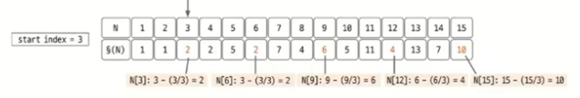
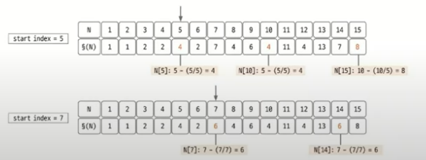
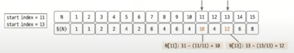
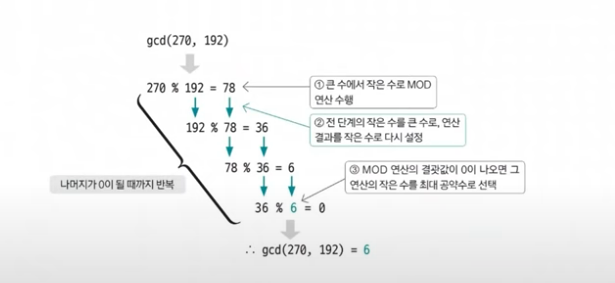

# 알고리즘 스터디 8주차 일지
2024.06.25

## 소수구하기
코딩 테스트에서 소수를 구하할 때는 에라토스테네스의 체를 많이 사용한다.

에라토스테네스의 체 원리는 다음과 같다.

1. 구하고자하는 소수의 범위만큼 1차원 배열을 생성한다.
2. 2부터 싲가하고 현재 숫자가 지워지지 않을 때는 현재 선택된 숫자의 배수에 해당하는 수를 배열에서 끝까지 탐색하면서 지운다.
3. 배열 끝까지 2번을 반복한 후 배열에 남아있는 모든 수를 출력한다.

<br>
1부터 30까지의 수 중 소수를 구한다할 때

1. 1부터 30까지 배열을 생성하고 1은 소수가 아니므로 삭제한다.
2. 선택한 수의 배수를 모두 삭제한다.
    * 2의 배수를 모두 삭제한다.
    * 3의 배수를 모두 삭제한다.
3. 2과정을 끝까지 반복

<br>
에라토스테네스의 체의 시간복잡도는 배수를 삭제하는 연산으로 실제 구현에서 바깥쪽 for문을 삭제하는 경우가 빈번하게 발생하기 때문에 O(Nlog(longN))이다.

<br>

## 백준 1929번: 소수구하기

```java
import java.util.Scanner;

public class BOJ1929 {
    public static void main(String[] args) {
        Scanner scanner = new Scanner(System.in);
        int M = scanner.nextInt();
        int N = scanner.nextInt();

        // 1. N+1까지의 배열 생성
        boolean[] isPrime = new boolean[N + 1];
        // 사실 여기서 1을 제외시키는 것, 2부터 모든 수를 true로 설정
        for (int i = 2; i < isPrime.length; i++) {
            isPrime[i] = true;
        }

        // 루트N보다 작거나 같을 때
        for (int i = 2; i <= Math.sqrt(N); i++) {
            //i의 경우 같이 참이라면
            if (isPrime[i]) {
                //배수를 다 제외시키는 것, false로 바꾼다.
                for (int j = i * i; j <= N; j += i) {
                    //i가 2라면 4부터 모든 2의 배수가 다 false
                    isPrime[j] = false;
                }
            }
        }

        //숫자 M부터 참인 것만 출력 = 소수만 출력
        for (int i = M; i <= N; i++) {
            if (isPrime[i]) {
                System.out.println(i);
            }
        }
    }
}
```

<br>

## 오일러 피
오일러 피 함수 P[N]의 정의: 1부터 N까지 범위에서 N과 서로소인 자연수의 개수
<br>

**오일러 피의 핵심 이론**

1. 구하고자하는 오일러 피의 범위만큼 배열을 자기 자신의 인덱스값으로 초기화한다.
2. 2부터 시작해 현재 배열의 값과 인덱스가 같으면(= 소수일 때) 현재 선택된숫자(K)에 해당하는 수를 배열 끝까지 탐색하며 P[i] = P[i] - P[i]/K 연산을 수행한다. (i는 K의 배수)
3. 배열 끝까지 2번을 반복한다.


예시)


여기보면 두번째 배열이  P[i] = P[i] - P[i]/K 연산이 수행된 것을 확인할 수 있다.

선택된 숫자(K) = 2
* 2 - 2/2
* 4 - 4/2
* 6 - 6/2
* 8 - 8/2
* 10 - 10/2
* 12 - 12/2
* 14 - 14/2

위 과정을 계속 반복







그래서 최종적으로 보면 1부터 15까지의 숫자 중에서 4와 4이하 숫자 중 서로소가 되는 개수는 2개(1, 2), 5와 서로소가 되는 숫자는 4개 (1, 2, 3, 4), 9와 서로소가되는 숫자는 6개(1, 2, 4, 5, 7 ,8) 등등 이라는 뜻이 된다.

<br>

## 유클리드 호제법
두 수의 최대공약수를 구하는 알고리즘
<br>

**유클리드 호제법의 핵심이론**

MOD연산을 이해하고 있어야한다.

MOD연산: 나머지를 이용하는, 최대공약수를 구하는데 사용되는 핵심 연산

* 10 MOD 4 = 2
* 10 % 4 = 2
<br>

1. 큰 수를 작은 수로 나누는 MOD 연산을 수행한다.
2. 앞 단계에서의 작은 수와 MOD 연산 결괏값(나머지)으로 MOD 연산을 수행한다.
3. 2번을 반복하다가 나머지가 0이 되는 순간 작은 수를 최대공약수로 선택한다.

