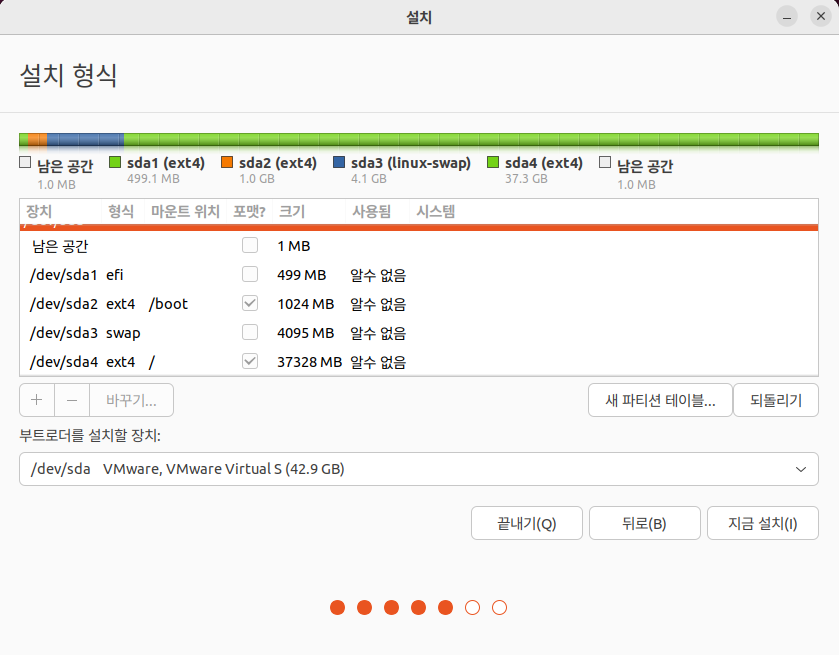
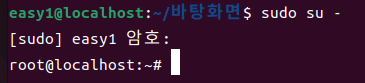
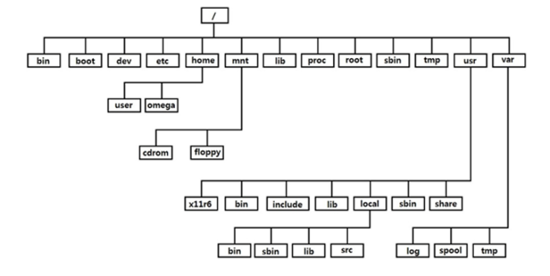
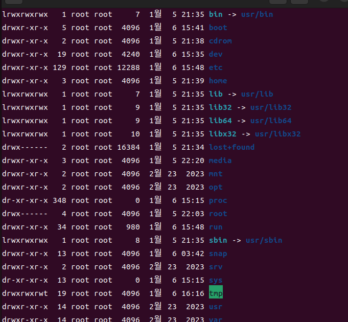

<h1>리눅스 day2</h3>
 
<h3>host 환경과 guest 환경</h3>
host 환경은 실제 컴퓨터 환경  
guest 환경은 가상 컴퓨터 환경
 

* 하나의 입력장치로 양 쪽 컴푸터를 동시에 제어하면 안되기 때문에 입력장치가 인식되는 컴퓨터를 지정해줘야 한다.
* 환경 변환 방법
    1. host 환경 -> guest 환경  : 가상 컴퓨터 화면 클릭
    2. guest 환경 -> host 환경  : ctrl + alt

<h3>가상머신 초기설정</h3>   
가상머신 접속 > 화면해상도 다시 설정 (높게, 16:10 비율로) > ubuntu install 해줄것

이후 EFI 시스템 파티션으로 500MB 크기로 나눠줄 것  
EXT4 저널링 파일 시스템으로 1024MB 크기로 나눠줄 것, 마운트 위치는 /boot  
스왑영역으로 4096MB 크기로 나눠줄 것  
그리고 남은 용량은 EXT4 저널링 파일 시스템, 마운트 위치는 /로 설정해줄 것

위 사진처럼 되도록!  

**스왑 영역이란?**

swap 영역 RAM을 2048mb라는 최소치만 주고, 2GB라는 최소 추천값만 주고 넘어왔다.
이 용량이 부족하기 때문에 하드디스크에서 일정 용량을 떼다가 RAM처럼 쓸 수 있도록 만들어 준 것이 swap이다.

그러나 swap이 RAM을 완벽하게 대체할 수 없고 일반적으로 RAM의 2~4배 정도를 잡아준다.

snapshot을 이용해 현재 상태를 저장할 수 있다.

 

<h3>기본 사항들..</h3>

* 시스템 종료: poweroff
* 화면 청소: clear
* 관리자(root) 계정으로 로그인 하려할 때: sudo su -

**일반 사용자 계정 & 관리자 계정**

* 일반 사용자 계정: 서버를 사용하는 모든 사람들이 각각 갖게 되는 일반적인 작업만 가능한 계정
* 관리자 계정: 서버 운영자를 위한 계정, 서버의 관리작업이 가능한 계정
    * Linux, Unix에서는 root라는 계정이 관리자 계정
    * windows에서는 administrator 라는 계정이 관리자 계정

 
보통은 일반 사용자로 로그인하여 사용을 하다가 필요할 때 관리자 권한을 빌려서 사용함
(이번에 공부할 때는 편의상 관리자 root를 기본으로 사용할 것)  

**프롬프트 출력 내용 살펴보기**

root@localhost: ~#

* root      : 현재 접속한 사용자 ID  
              입력한 명령이 어느 사용자 권한으로 동작되는지 출력
* localhost : 현재 사용 중이 장치의 이름  
              입력한 명령이 어느 장치에서 동작되는지 출력
* ~         : 현재 위치, 내가 현재 위치한 디렉토리가 출력
            (디렉토리: CLI 환경에서 사용하는 폴더)
* \#        : 사용 권한, 현재 접속한 사용자가 어느정도의 권한을 갖고있는지 표시  
            (\#: 관리자 권한, $: 일반 사용자 권한)
 

**기본 디렉토리**

* 현재 존재하는 모든 운영체제는 디렉토리 간의 tree 구조로 운영체제가 구성되어 있다.
* Linux는 최상위에 / 라는 이름의 디렉토리가 존재하고, / 를 기준으로 하는 tree 구조로 구성
    * Linux 내부의 모든 파일/디렉토리는 / 내부 어딘가에 위치

<리눅스 디렉토리 tree 구조>

* ls -l / : root 디렉토리에서 파일 및 상세정보 나열

* / 내부에 기본 생성되는 디렉토리 설명
    * /bin      : 기본 명령어(일반 사용자 + 관리자 명령어)들이 저장된 디렉토리로 연결되는 link 파일
    * /boot     : 부팅에 관련된 각종 설정 파일과 이미지 파일들이 저장된 디렉토리
    * /cdrom    : cd를 편하게 연결할 수 있도록 만들어 놓은 디렉토리
    * /dev      : 장치 파일이 생성되는 디렉토리
    * /etc      : 각종 설정 파일 들과 OS의 환경 설정 파일이 저장되는 디렉토리
    * /home     : 일반 사용자들의 홈 디렉토리가 생성되는 기본 위치
        * 홈 디렉토리: 사용자 개인 디렉토리, 로그인 시 시작되는 최조 위치  
        기본적으로 다른 사용자가 접근할 수 없다.
    * /lib 들   : 각종 라이브러리가 저장된 디렉토리 
    * /media    : local device(내 장치에 직접 연결되는 device)를 사용하기 편하게 연결해주는 디렉토리
    * /mnt      : remote device(local device를 제외한 모든 장치)를 사용하기 편하게 연결해주는 디렉토리
    * /opt      : /usr에 저장되지 않는 프로그램들이 저장되는 디렉토리
    * /proc     : 실행 중인 프로세스에 대한 가상 파일들이 저장되는 디렉토리
    * /root     : 관리자 root의 홈 디렉토리
    * /run      : 실행 중인 각종 서비스에 필요한 파일들이 생성되는 디렉토리
    * /sbin     : 시스템 제어 멸영어(관리자 전용 명령어)들이 저장된 디렉토리로 연결되는 link 파일
    * /snap     : snap을 이용한 프로그램 관리를 하기 위해서 존재하는 디렉토리
    * /srv      : 서버 운용시 외부 사용자가 비교적 쉽게 접근할 수 있도록 설정하는 디렉토리
    * /sys      : 시스템 동작 과정에서 필요한 각종 파일들이 생성되는 디렉토리
    * /tmp      : 임시파일/디렉토리가 생성되는 디렉토리
    * /usr      : 대부분의 응용프로그램이 설치되는 위치
    * /var      : 로그 등의 자주 변경되는 시스템 파일들이 저장되는 디렉토리

    * -> 기호는 symbolic link를 의미 (windows의 바로가기와 비슷한 개념)
        ex) bin -> usr/bin      : /bin은 /user/bin으로 연결된다.

