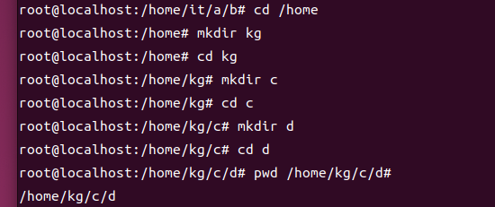
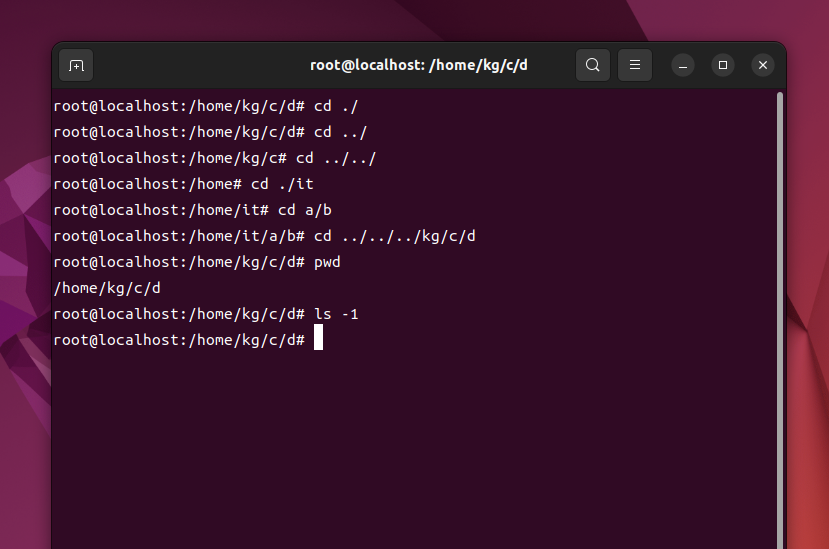
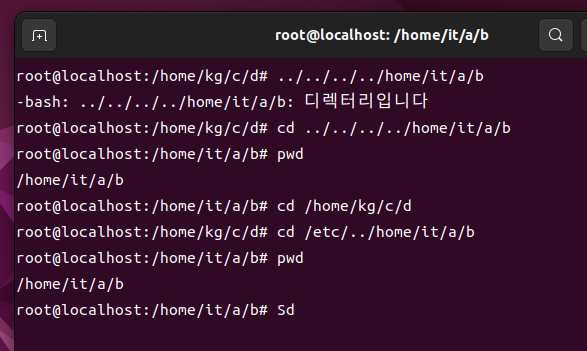
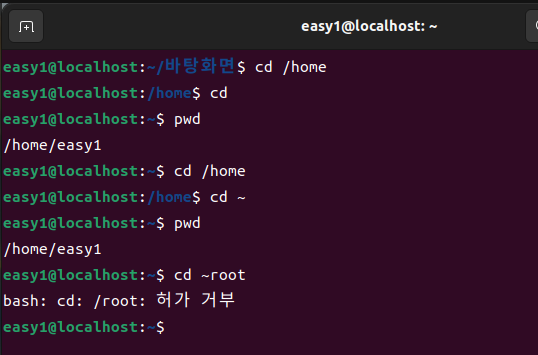
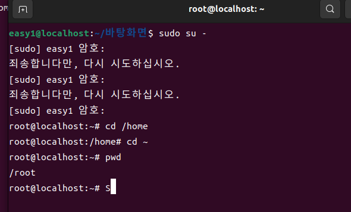
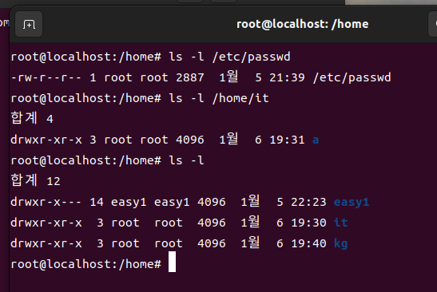
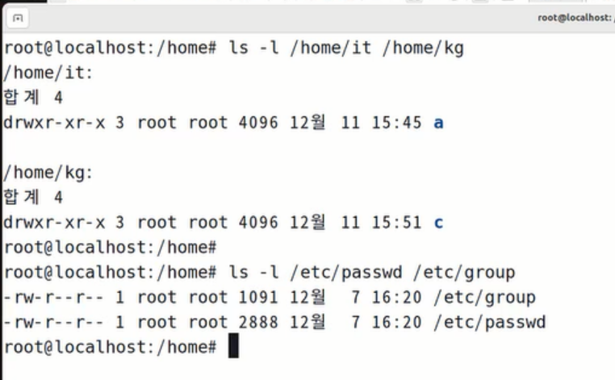

<h1>리눅스 day3</h1>

<h3>경로</h3>

* 경로: 파일이나 디렉토리에 찾아가는 길
* CLI 환경에서 명령어를 입력할 때 입력된 명령어에 파일이나 디렉토리가 대상으로 들어가면 경로랑 이름 모두 입력해야함
* 파일 디렉토리에 찾아가기 위해서 경로의 수를 입력할 때 절대경로와 상대 경로로 구분해 사용함 (두 가지 방식을 전부 사용할 수 있어야 함)
    * 절대경로: / 를 기준으로 파일이나 디렉토리에 찾아가는 방식
        * / 는 리눅스의 가장 상위에 위치한 디렉토리임(= 절대로 바뀌지 않음), 절대적인 기준점이 됨
        * 절대적인 기준점이 /이기 때문에 절대경로라 칭함
    * 상대경로: 내 위치를 기준으로 파일이나 디렉토리에 찾아가는 방식
        * 나의 위치에 따라 목적지를 찾아가는 방식이 달라짐

|절대경로( / 기준)|상대경로(내 위치 기준)|
|:--------------:|:------------------:|
|cd /home/kg/c/d|cd ./|
|cd /home/kg/c|cd ../|
|cd /home|cd ../../|
|cd /home/it/a/b|cd a/b|
|cd /home/kg/c/d|cd ../../../kg/c/d|

* 기호
    * .     : 현재 디렉토리
    * ..    : 상위 디렉토리
    * ~     : 홈 디렉토리 (사용자의 개인공간)
    * \*    : 모든 종류와 모든 길이의 문자를 대체하는 기호(=모든 것) 
* 괄호
    * [ ]   : 생략이 가능한 항목들을 묶어주는 용도

**예제**

d 에서 b로 아동
조건 1. cd 명령어 뒤에 입력하는 경로에 반드시 etc를 포함
조건 2. 명령어는 한 줄만 입력
  
정답

올라가서 etc를 거쳐서 다시 내려오는 방법고 etc가 / 밑에 있으니 /etc 갔다가 내려오는 방법이 있을 것

<h3>기초 명령어</h3>

기초 명령어: 운영체제를 다루기 위해 기본적으로 알고 있어야 하는 명령어

**형식**

|명령어|옵션|보조옵션|대상|
||:--:|:--:|:-----:|:--:|
|clear||||
|pwd||||
|mkdir|||directory|
|cd|||directory|
|ls|-l|||

<h3>명령어 의미 정리</h3>

**cd: Change Directory 약자, 디렉토리 이동(변경)**

* 형식은 기본 형식으로 사용
* 대상
    * directory : 해당 디렉토리로 이동
    * .         : 현재 디렉토리로 이동
    * ..        : 상위 디렉토리로 이동
    * 생략      : 명령어를 입력한 사용자 자신의 홈 디렉토리로 이동
    * ~         : 명령어를 입력한 사용자 자신의 홈 디렉토리로 이동
    * ~사용자명 : 해당 사용자의 홈 디렉토리로 이동(root 전용)

|:----------------------:|:-----------------------:|
|||

**pwd: Print Working Directory의 약자, 현재 작업 디렉토리의 절대 경로를 출력**
* 형식은 기본 형식으로 사용

**ls**
* 대상에 따라 출력되는 범위가 달라진다.
    * 파일을 대상으로 하면 파일 자체를 출력
    * 디렉토리를 대상으로 하면 디렉토리 내부의 목록을 출력
    * 대상을 생략하면 현재 위치한 디렉토리 내부의 목록을 출력
* 대상을 생략할 수 도 있고, 여러 파일과 디렉토리를 넣을 수도 있다.
    * 여러개 정보를 확인할 때 파일과 디렉토리를 함꼐 지정할 수 있다.
* 형식의 기본으로 정리
* 옵션
    * -l : 자세한 정보를 함께 출력
        * -l 옵션으로 출력되는 내용: -rw-r--r-- 1 root root 2888 12월 25 16:20 /etc/passwd
            * -             : 대상 개체의 형식(- : 파일, d : 디렉토리)
            * rw-r--r--     : 허가권
            * 1             : link 수
            * root root     : 소유권
            * 2888          : 크기(byte 단위, 디렉토리는 정상적인 용량 출력 X)
            * 12월 25 16:20 : 마지막으로 수정된 날짜와 시간
            * /etc/passwd   : 대상의 이름
    * -a : 대상이 디렉토리 인경우 디렉토리 내부의 숨겨진 항목들을 찾아 함께 출력
    * -d : 대상이 디렉토리인 경우 디렉토리 자체의 정보를 출력
    * -R: 대상이 디렉토리인 경우 하위 디렉토리가 존재한다면 그 내부 목록까지 출력

