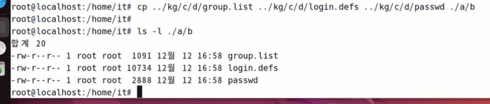
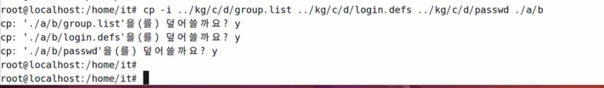

<h1>리눅스 day4</h1>

* 기호
    * .     : 현재 디렉토리
    * ..    : 상위 디렉토리
    * ~     : 홈 디렉토리 (사용자의 개인공간)
    * \*    : 모든 종류와 모든 길이의 문자를 대체하는 기호(=모든 것) 
* 괄호
    * [ ]   : 생략이 가능한 항목들을 묶어주는 용도

<h3>명령어 의미 정리 (지난시간에 이어서)</h3>

**cp: 복사 + 붙여넣기**
* 기본적으로 파일만 복사 가능
    * 디렉토리의 복사는 별도의 옵셕이 필요
* 원본의 이름을 유지하면서 복사 혹은 이름을 변경하면서 복사 가능
    * 이름을 변경하면서 복사할 때는 원본을 하나만 사용
* 형식: cp [\옵션] 원본 [\원본] ... [\원본] 복사할위치[+이름]
* 옵션
    * -i : 확인 메세지 출력(cp에서는 덮어쓰기 확인)
    * -r : 디렉토리도 복사

문제1)

cp 명령어 세 줄의 경로 요소를 절대경로 -> 상대경로, 상대경로 -> 절대경로로 바꿔서 입력해볼 것

cp /bakck/group.list /home/it/group/list
cp /backup/passwd./
cp /backup/login.defs ./login
 
cp ../../backup/group.list ./group.list
cp ../../backup/passwd /home/it
cp ../../backup/login.defs /home/it/login 

문제2)

문제)

/home/kg/c/d/ 안에 있는 파일들으 /home/it/a/b 안으로 복사
조건 1: 디렉토리 복사x
조건 2: 작업 위치는 /home/it
조건 3: 명령어는 한 줄

-i 옵션 사용, 덮어씌울 거냐 물어봄

**mv: 잘라내기 + 붙여넣기**

* 파일과 디렉토리 전부 이용 가능 원본의 이름을 유지하면서 이동 + 이름을 변경하면서 이동할 때는 원본을 하나만 사용
* 원본의 이름을 유지하면서 이동 = 이름을 변경하면서 이동 가능 
* 이름 바꾸기 명령어로 사용가능
* 형식 mv [옵션] 원본 [원본] ... [원본] 이동할 위치[+이름]
* 옵션
    * -i : 확인 메세지 출력(mv는 덮어쓰기 확인)

**mkdir: make directory의 약자, 빈 디렉토리 생성**

* 생성하려는 디렉토리의 상위 디렉토리(= 경로)가  없는 경우에는 생성 X
    * 별도의 옵션을 함께 사용하여 한 번에 생성 가능
* 형식은 기본 형식으로 사용
* 옵션
    * -p : 사위 디렉토리(= 경로)가 없는 경우 함께 생성

**rmdir: remove directory의 약자, 빈 디렉토리의 삭제만 가능**
* 형식은 기본 형식으로 사용
* 옵션
    * -p: 대상 디렉토리 삭제 후 상위 디렉토리의 삭제 시도

**rm: remove의 약자**

* 기본적으로 파일의 삭제만 가능
    * 별도의 옵션을 사용하여 디렉토리도 삭제 가능
* 형식은 기본 형식으로 사용
* 옵션
    * -i : 확인 메세지 출력(rm은 삭제할 것인지 확인)
    * -r : 디렉토리도 삭제